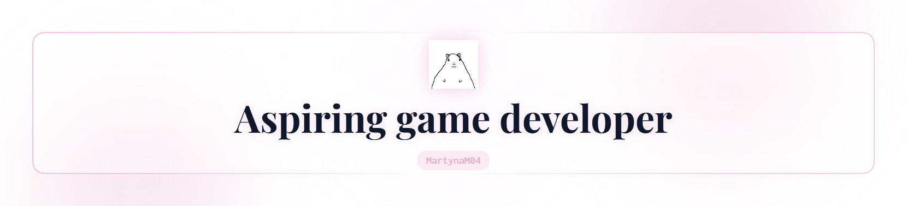

<!-- 
=======================================================================
  MARTYNA'S GITHUB PROFILE README
  Theme: Pastel Pink, Kawaii, Fantasy Indie Game Dev
  Colors: #E4A5C2, #F7D7E6, #F8BBD0
=======================================================================
-->

<!-- EXISTING HEADER -->
<picture>
  <source media="(prefers-color-scheme: dark)" srcset="art/header-dark.png"> 
  <source media="(prefers-color-scheme: light)" srcset="art/header-light.png"> 
  
</picture>

  

<!-- PROFILE CARD -->
<table align="center" style="border: none;">
  <tr style="border: none;">
    <td align="center" style="border: none; padding: 20px;">
      <h1>Hi, I'm Martyna</h1>
      
      

        &nbsp;•&nbsp; Storyteller &nbsp;•&nbsp; World Builder &nbsp;•&nbsp; Big Dreamer &nbsp;•&nbsp; 
          
      

    </td>
  </tr>
</table>

  
  
  

<!-- INTRODUCTION -->
### About Me 

I'm an aspiring **Game Developer** obsessed with low-poly fantasy worlds and deep RPG mechanics. Currently living inside **Unity 6.5** and constantly messing with new features.

I act as the lead architect of my games. I design the systems, build the lore, and make the rules. AI assistants like **Claude** and **Claude Code** are my contractors. They write the code faster than I can, but I'm the one calling the shots.

  
  
  

<!-- CURRENT PROJECT (STEAM PAGE VIBE) -->
### WORKING ON...
## Wanderer's Tale
*A low poly fantasy 3D adventure made in Unity 6.5.*

<table align="center" width="80%" style="border: none;">
  <tr style="border: none;">
    <td width="50%" style="border: none; padding: 20px; vertical-align: middle;">
      <b>The Legend:</b>  
      The story follows a fearless young woman gifted with magical powers and accompanied by her irreplaceable sword. She wanders across a beautifully crafted low-poly world helping people in need, discovering forgotten places, and uncovering mysteries while bringing hope wherever she travels.
       
    </td>
    <td width="50%" style="border: none; padding: 20px; vertical-align: middle;">
      <b>Current Focus:</b>  
      &nbsp;•&nbsp; Action-driven Combat Systems 
      &nbsp;•&nbsp; Branching Dialogue Mechanics 
      &nbsp;•&nbsp; World Building & Atmosphere 
      &nbsp;•&nbsp; Unity 6.5 Technologies 
      &nbsp;•&nbsp; AI-assisted Workflows 
       
    </td>
  </tr>
</table>

  
  
  

<!-- TECH STACK & LEARNING -->
### My Stack
<b>Game Dev & Programming</b>
 
    
  
      <b>Art & Design</b> 
        
      <b>Tools & Workflows</b> 
      

  
  
  

<!-- ROADMAP & FUN FACTS -->

<table align="center" width="100%" style="border: none;">
  <tr style="border: none;">
    <td width="50%" style="border: none; padding: 10px; vertical-align: middle;">
       
      
<b>Currently Learning</b>  
      

      <b> UNITY 6.5 </b> 
      <b>&nbsp;•&nbsp; </b> Shader & VFX Graph  
      <b>&nbsp;•&nbsp; </b> New Input System  
      <b>&nbsp;•&nbsp; </b> ProBuilder  
      <b>&nbsp;•&nbsp; </b> Terrain Tool   
      <b> OTHER </b> 
      <b>&nbsp;•&nbsp; </b> HTML  
      <b>&nbsp;•&nbsp; </b> GitHub Navigation  
      <b>&nbsp;•&nbsp; </b> Advanced AI Workflows  
      <b>&nbsp;•&nbsp; </b> LLM Orchestration  
      
       
    </td>
    <td width="50%" style="border: none; padding: 10px; vertical-align: middle;">
       
      
<b>Facts About Me</b>  
      

      &nbsp;•&nbsp; Terrified of stinging insects. 
      &nbsp;•&nbsp; A clueless but enthusiastic football fan. 
      &nbsp;•&nbsp; I have one signature joke I tell everyone. 
      &nbsp;•&nbsp; I can sing two Polish "cringe" songs in my sleep. 
      &nbsp;•&nbsp; A writer with too many ideas to finish a book. 
      &nbsp;•&nbsp; Learned HTML at 13 by running a fanfic blog.  
      
       
    </td>
  </tr>
</table>

  
  
  

<!-- FAVOURITE GAMES -->
### Inspirations & Favorite Realms

   
  
  
  
  
  
  
  

  

<!-- NOW PLAYING (SPOTIFY) -->
### Listening To...
 

  
  
  

<!-- GITHUB STATS & ACTIVITY -->
### Special Analytics

 

  
#### GitHub Stats

  
 
  
#### Streak Stats

 

<!-- Activity Graph -->

 

<!-- Contribution Snake -->

  <h4>Contribution Snake</h4>
  <picture>
    <source media="(prefers-color-scheme: dark)" srcset="https://raw.githubusercontent.com/MartynaM04/MartynaM04/output/github-contribution-grid-snake-dark.svg">
    <source media="(prefers-color-scheme: light)" srcset="https://raw.githubusercontent.com/MartynaM04/MartynaM04/output/github-contribution-grid-snake.svg">
    
  </picture>

  
  
  

<!-- CONTACT -->
### Find Me Here

  
  
  
  
    
  <!-- Ko-fi Button -->
  

   

<!-- FOOTER -->

  

    <b>Building worlds, one system at a time.</b> 🐀
  

   
  <!-- Kawaii Visitor Counter -->
  

